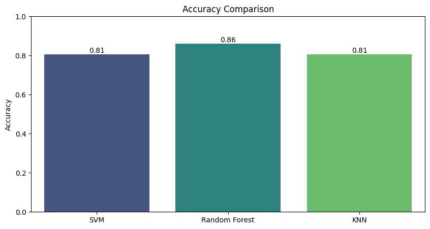
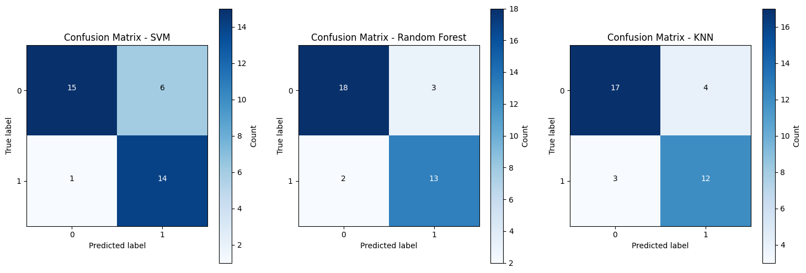
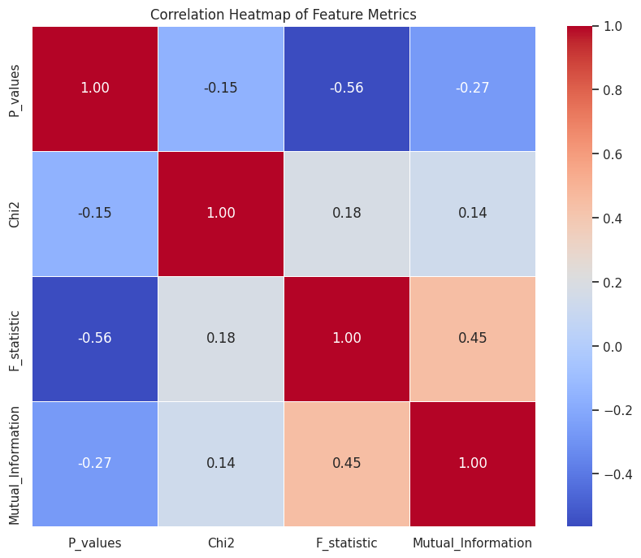
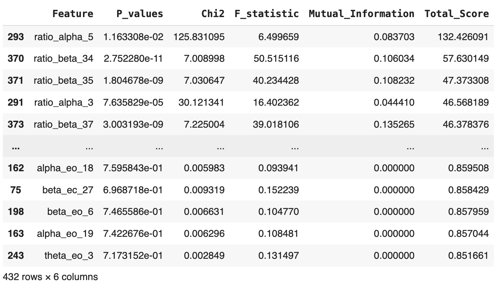

A collection of random decision trees, less sensitive to training data than a single decision tree. It avoids overfitting and generalizes well to new data.

### Training Without Feature Selection

*Figure 1: Accuracy Obtained Before Feature Selection*

*Figure 2: Confusion Matrix Before Feature Selection*

## Methodology

1. **Feature Engineering Techniques**: Explore three techniques—Filtering, Wrapping, and Embedding.
2. **Classifier Models**: Test on three commonly used classifiers for EEG data—KNN, SVM, and Random Forest.
3. **Performance Measurement**: Utilize Leave-One-Subject-Out Cross-Validation for accuracy, sensitivity, and specificity.

## Feature Selection Methods

### Filtering Methods

1. **Measure Relevance**: Utilize scores like f_statistics, p_statistics, chi2_scores, and mutual_info_scores.
2. **Rank Features by Relevance**: Sum of scores determines top features.
3. **Keep Top K Relevant Features**: Use cross-validation with various approaches.
   - GridSearchCV with SVM
   - GridSearchCV with PCA and SVM
   - GridSearchCV, SelectKBest, RFE, PCA with RandomForest, LASSO, and SVM
   - Manual selection (Brute Force)

   
   *Figure 3: Correlation Heatmap of Feature Metrics*

   
   *Figure 4: Features Ranked by Relevance (Total Score)*

   | Number of Selected Features (k) | Mean Accuracy |
   |----------------------------------|---------------|
   | Approach 1                       | 151           | 0.89          |
   | Approach 2                       | 89            | 0.88          |
   | Approach 3                       | 202           | 0.91          |
   | Approach 4                       | 343 (SVM)      | 0.9           |

4. **Hyperparameters Optimization**: Tune parameters for Random Forest, KNN, and SVM.

   
   *Figure 5: Mean Accuracy of Top k Selected Features*

### Wrapper Methods

1. **Backward Elimination**: Remove least impactful features until a threshold is met.

   - Initial Performance: 0.822
   - Removed feature: theta_ec_18
   - Updated Performance: 0.867
   - Performance degraded. Stopping.

2. **Bi-directional Elimination**: Combine forward and backward elimination.

### Embedded Methods

1. **L1 Regularization (LASSO Regression)**: Encourages sparsity in the model by adding a penalty term.

2. **L2 Regularization (Ridge Regression)**: Takes the sum of squared coefficients as a penalty term.

3. **Elastic Net Regression**: Combines L1 and L2 regularization.

   - Result: L1 and ElasticNet produced few non-zero coefficients, indicating low multicollinearity.

   
   *Figure 6: Ridge Regression Scores*

## Feature Extraction Methods

### Standardization & PCA

Standardization rescales features to have a mean of 0 and standard deviation of 1. PCA identifies principal components.

### Singular Value Decomposition (SVD) & Randomized PCA

SVD decomposes a matrix into three others, providing a compact representation. Randomized PCA is an approximation algorithm.

### t-SNE for Non-linear Projection

t-SNE is effective for visualizing high-dimensional data in a lower-dimensional space.

### Binarization

Binarization converts continuous values into binary format based on a threshold.

### One-Hot Encoding

One-Hot Encoding represents categorical variables as binary vectors.

## Evaluation Techniques

- **Leave-One-Subject-Out Cross-Validation**: Evaluate accuracy, sensitivity, and specificity.

## Results & Conclusion

The feature engineering methods significantly impacted model performance. Filtering methods consistently achieved high accuracy but were time-consuming. Wrapper methods, while effective, demanded significant computation time. Embedded methods showed varied outcomes, with SVM and KNN achieving high accuracy. Feature extraction methods required careful consideration and exhibited sensitivity to data characteristics.

### Summary of Results

| Approach (Algorithm)                           | Mean Accuracy |
|------------------------------------------------|---------------|
| Without Feature Selection                       | SVM: 0.81, RF: 0.86, KNN: 0.81 |
| Filtering Methods                               | SVM: 0.91, SVM (PCA): 0.88, Manual: 0.9 |
| Wrapper Methods                                 | SVM (Backward): 0.92 |
| Embedded Methods                                | Ridge Regression (SVM): 0.95, Ridge Regression (KNN): 0.74, Ridge Regression (RF): 0.85 |
| Feature Extraction                               | Standardization & PCA: 0.92, SVD & Randomized PCA: 0.56, t-SNE: 0.58, Binarization: 0.92, One-Hot Encoding: 1.00 |

In conclusion, the choice of feature engineering method significantly influences model performance. Understanding the trade-offs between computation time and accuracy is crucial for selecting the most suitable technique for a given scenario.

